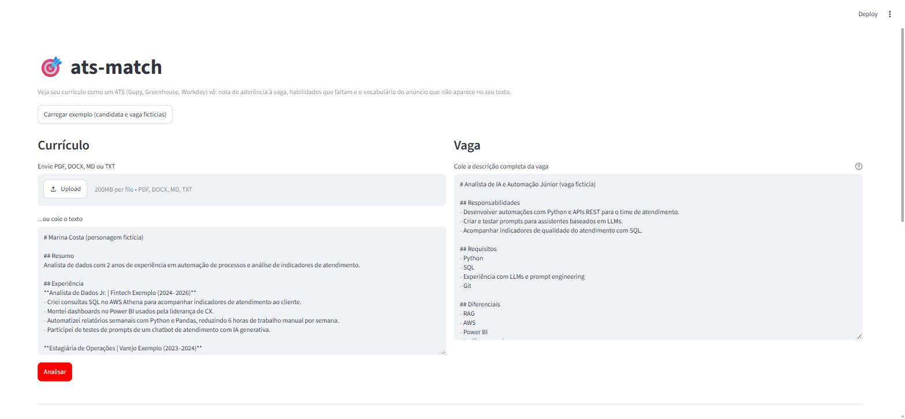
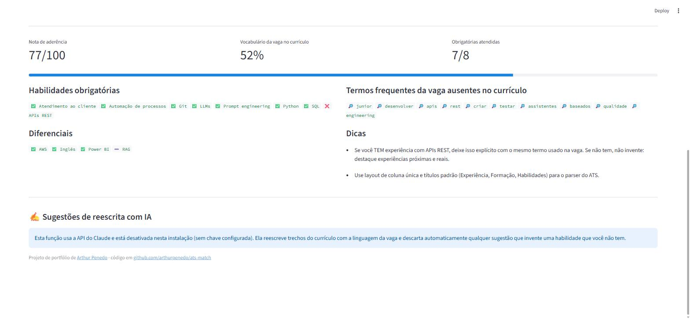

# ats-match

[](https://github.com/arthurpenedo/ats-match/actions/workflows/ci.yml)
[](https://github.com/arthurpenedo/ats-match/actions/workflows/demo.yml)


> Compara um currículo com uma vaga do jeito que um **ATS** (Gupy, Greenhouse, Workday) compara, mostra o que está faltando e sugere reescritas **honestas** com a ajuda do Claude.

## O problema

No Brasil, a maioria das vagas passa primeiro por um ATS. Ele extrai o texto do currículo, procura as habilidades e palavras-chave do anúncio e **ranqueia** os candidatos. Um currículo bom, mas escrito com um vocabulário diferente do anúncio, cai para o fim da fila, e às vezes nenhuma pessoa chega a ler.

O `ats-match` faz essa leitura antes do envio e responde três perguntas:

1. **Qual a minha aderência a esta vaga?** Nota de 0 a 100.
2. **O que está faltando?** Habilidades obrigatórias, diferenciais e termos do anúncio.
3. **Como reescrever sem mentir?** Sugestões geradas por LLM, com uma trava que **descarta qualquer sugestão que invente uma habilidade** ausente do currículo.

## Demo

**[Abrir a demo: arthurpenedo.github.io/ats-match](https://arthurpenedo.github.io/ats-match/)** — o app roda **inteiro no seu navegador** (Python compilado para WebAssembly via [stlite](https://github.com/whitphx/stlite)). Não há servidor: o currículo enviado não sai do seu computador. O primeiro carregamento leva uns 20 segundos. A reescrita com IA fica desativada na demo, porque precisaria de chave de API.

A cada push, o CI monta o site, abre num Chromium de verdade, clica em "Carregar exemplo" → "Analisar" e confere que a nota calculada no navegador é **igual** à do Python antes de publicar.




Também funciona pela linha de comando, aceitando **PDF, DOCX, Markdown ou TXT**:

```text
$ ats-match curriculo.pdf examples/vaga.md

Nota de aderência: 77/100

Obrigatórias atendidas: Atendimento ao cliente, Automação de processos, Git, LLMs, Prompt engineering, Python, SQL
Obrigatórias faltando:  APIs REST
Diferenciais atendidos: AWS, Inglês, Power BI
Cobertura de vocabulário da vaga: 52%
Termos da vaga ausentes: junior, desenvolver, apis, rest, criar, testar, assistentes, baseados, qualidade, engineering

- Se você TEM experiência com APIs REST, deixe isso explícito com o mesmo termo usado na vaga. Se não tem, não invente: destaque experiências próximas e reais.
```

## Como funciona

```
currículo ─┐                        ┌─► nota 0-100
           ├─► normalização ─► ─────┼─► habilidades atendidas / faltando
vaga ──────┘   (acentos, stopwords) │   (obrigatórias × diferenciais)
                                    └─► vocabulário do anúncio ausente
                                                  │
                                    (opcional)    ▼
                              Claude sugere reescritas ─► validação anti-invenção ─► sugestões
```

- **Leitura de arquivos** (`extract.py`): PDF e DOCX (inclusive tabelas, comuns em modelos de currículo). Se o PDF é uma imagem, o app **avisa que um ATS também não conseguiria ler**, um problema real e pouco conhecido.
- **Radicalização por truncamento** (`text.py`): "automatizei", "automação" e "automações" caem no mesmo radical e contam como o mesmo termo. A lista de termos ausentes mostra a palavra como está na vaga, não o radical.
- **Taxonomia de habilidades** (`skills.py`): cada habilidade tem sinônimos que os ATS tratam como equivalentes (ex.: *Athena* → AWS, *IA generativa* → LLMs), com casamento por palavra inteira (*ml* não casa dentro de *html*).
- **Seções da vaga** (`matcher.py`): o que vem sob "Diferenciais"/"Desejável" pesa metade do que é obrigatório.
- **Nota:** 75% cobertura ponderada de habilidades + 25% cobertura dos 25 termos mais frequentes do anúncio.
- **Camada de IA** (`llm.py`): Claude (`claude-opus-5-5`) com **saída estruturada em JSON Schema**, tratamento de recusa e fallback no servidor. Toda sugestão passa por `validate_suggestions`.

### Decisões técnicas

- **Núcleo determinístico, IA opcional.** A nota é explicável e reproduzível, sem custo de API e sem variação entre execuções. O LLM entra só onde agrega: reescrever texto.
- **A trava anti-invenção é código, não prompt.** O prompt pede para não inventar, mas quem garante é a validação: se a sugestão cita uma habilidade que não está no currículo, ela é descartada.
- **Testes sem chave de API.** O cliente do Claude é injetável, e os testes usam um cliente falso.
- **Demo sem servidor.** Hospedar um app Streamlit exige uma máquina ligada; com o stlite o mesmo `streamlit_app.py` roda no navegador e fica no GitHub Pages, de graça e sem hibernar. De quebra, é o argumento de privacidade certo para um produto que recebe currículos.

## Como rodar

```bash
git clone https://github.com/arthurpenedo/ats-match && cd ats-match
pip install -e ".[dev,app]"

streamlit run streamlit_app.py                               # interface web
ats-match examples/curriculo.md examples/vaga.md             # linha de comando (PDF/DOCX/MD/TXT)
ats-match examples/curriculo.md examples/vaga.md --json      # JSON
ats-match examples/curriculo.md examples/vaga.md --sugerir   # sugestões com IA (precisa de ANTHROPIC_API_KEY)
uvicorn ats_match.api:app --reload                           # API: POST /match e POST /suggest

pytest -q
python scripts/build_web.py site                             # gera a demo estática (stlite)
```

## Limitações conhecidas

- A radicalização por truncamento é simples: pode juntar palavras diferentes com o mesmo começo (ex.: "análise" e "analista").
- A taxonomia cobre principalmente vagas de dados, IA e automação.
- PDFs escaneados (imagem) não são lidos, de propósito: o objetivo é alertar que o ATS também não lê.
- Não distingue nível de proficiência (ex.: inglês intermediário × avançado).

## Próximos passos

- [x] Leitura de PDF e DOCX
- [x] Radicalização em português
- [x] Interface web (Streamlit)
- [x] Demo pública (GitHub Pages, rodando no navegador, testada no CI)
- [ ] Ranking de várias vagas para o mesmo currículo
- [ ] Sugestões de reescrita validadas com a API real (hoje testadas com cliente simulado)

---

Feito por [Arthur Penedo](https://github.com/arthurpenedo) · [LinkedIn](https://www.linkedin.com/in/arthuralves-penedo)
